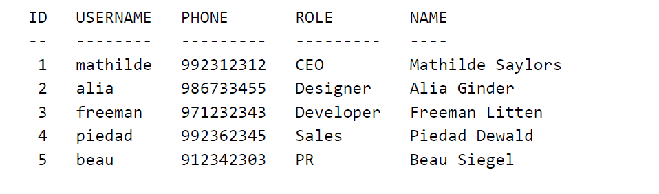

# VspaceCodeChallengeApp

Frontend developer code challenge.

## Demo

Coming soon...

[http://vspace.luisinacio.co.uk](http://vspace.luisinacio.co.uk/)

## Requirements

### Front-end developer assignment
This is a code challenge to evaluate your skills in @angular as a Frontend developer. You
should be able to finish this task in less than 1 day (although we will not monitor the time).
You can use any external libraries to resolve this problem.

The challenge consists of creating a simple post timeline. The posts consist of text but it can
refer to data from employees. The employees can be added and removed from the database
(can be saved in local storage, no backend required). No logins or other securities are
required.

### Your solution will be evaluated on the following:

#### Path ‘/admin’
This path will enable the user to add, edit and remove employees from a database.
Requirements:
* All fields (see below) are required;
* ID and Phone are unique;
* ID cannot be changed but all the other values can;
#### Optional:
* Username is only valid with the format [\w-_]+ 
* Example of a list of employees could be: 



#### Path ‘/’
On this path we want to create, edit and remove posts. Similar to the Facebook timeline, on
the top you have the ability to create a new post and below the list of previous posts is
shown ordered by date.
Requirements:
* By typing ‘@’ when creating a post it should popup an autocomplete to help user
select an employee;
Optional:
* By typing ‘#’ it should popup an autocomplete to help user select the phone number;
* On the post list, a popup should show with the full detail of the employee when
hovering their username, phone or role.
* Possibility to edit already posted messages.
NOTE: both username and phone number can be changed at any moment and should
reflect on the post. A possible solution is saving the text of the post as <employee id=”1”
field=”username”></employee> instead of @mathilde, or # 992312312;

### Checklist:

* You have met the requirements (optional points are not required but good if you want to
  show more);
* All data is saved and retrieved by services;
* Although you can use external libraries, you managed to get it to work by yourself;
* Keen eye for UX and details;
* You have thought about possible problems and found solutions for them.

### Other considerations:

Take the time you need to complete the task. During the process you are always welcome to
get back to us with any questions or doubts you might have and we will guide you in the right
direction. We are looking forward to seeing your work!

## Running application

Git clone the repository and install all the dependencies

```bash
git clone git@github.com:bazucas/Vspace-Code-Challenge.git
npm install
``` 
Install [Json-Server](https://github.com/typicode/json-server) as a full fake REST API

```bash
npm install -g json-server
```
Open a terminal window and run json-server with the mocked data from the data folder

```bash
json-server -w mockdata.json
```

Open another terminal windows and run the Angular application

```bash
npm start
```

## Architecture

### Structure

* Simple flat folder structure with a single main module, without any lazy children modules, or shared modules.
* No state management used (ngrx nor ng2-redux).
* Scss used.
* Mobile first concerns. 
* CRUD functionalities added for Admin and Posts.
* Generic API http verb methods.
* Mock data in the root directory.
* Vertical timeline.
* Auto complete fields.
* Tooltip showing employee information.

### Boilerplate code used

* PrimeNg
* PrimeFlex
* VerticalTimelineModule

## License
[MIT](https://choosealicense.com/licenses/mit/)
